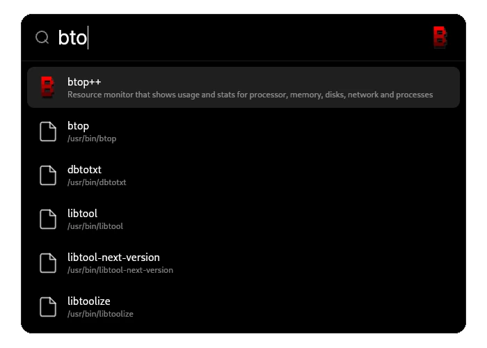

<div align="center">

# Waylight

**An opinionated application launcher for Wayland**



</div>

## Install

```bash
# Arch Linux
sudo pacman -S gtk4 gtk4-layer-shell webkitgtk-6.0 wl-clipboard libqalculate plocate fd zig

# Build & Install
git clone https://github.com/OlaHulleberg/waylight && cd waylight
zig build -Doptimize=ReleaseFast
sudo cp zig-out/bin/waylight /usr/local/bin/
```

## Setup

```bash
# Hyprland (~/.config/hypr/hyprland.conf)
exec-once = waylight --daemon
bind = SUPER, SPACE, exec, waylight --toggle

# Sway (~/.config/sway/config)
exec waylight --daemon
bindsym $mod+space exec waylight --toggle
```

## Features

- **App launcher** with fuzzy search
- **File search** powered by plocate + fd
- **Calculator** built-in (try `sqrt(16)` or `2^10`)
- **Instant** daemon mode, no startup delay

## License

MIT
